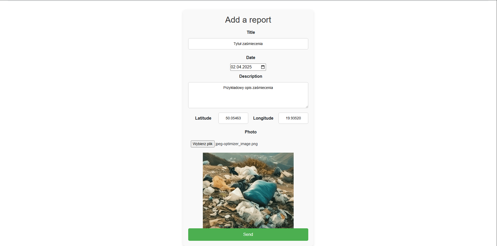
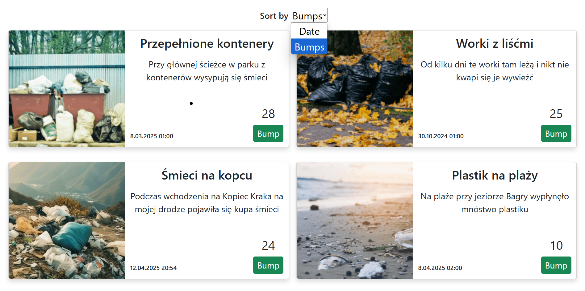
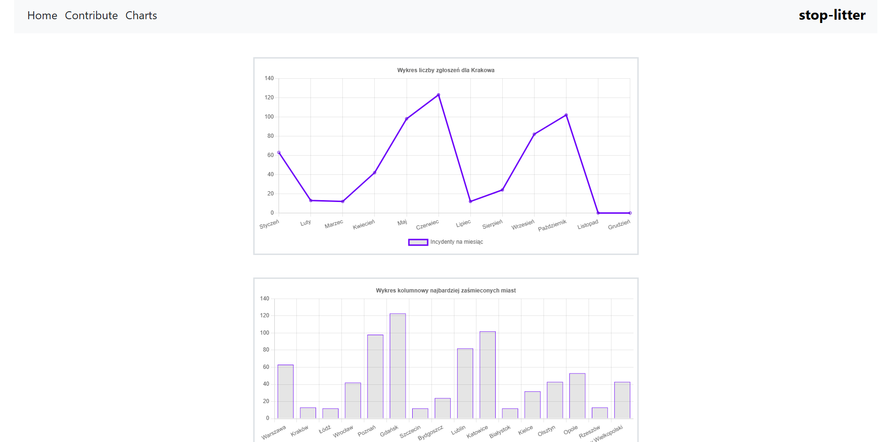
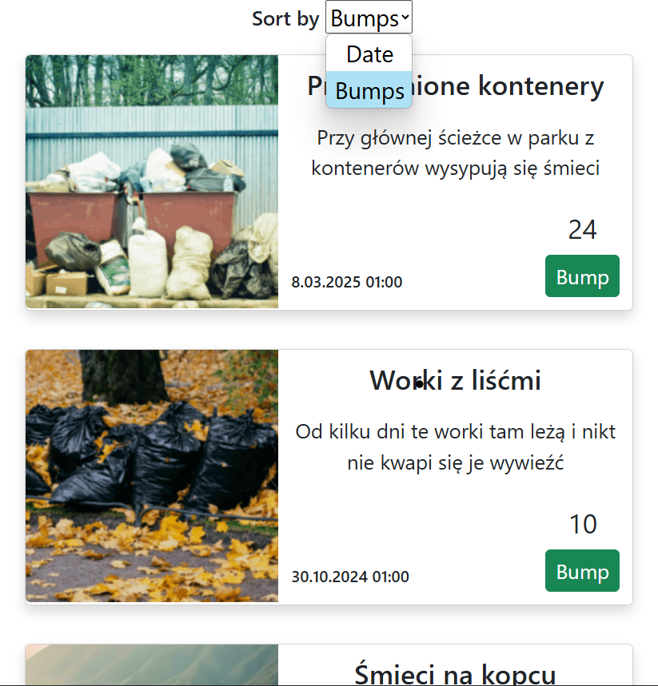

# stop-litter

It's a website created to keep our planet cleaner. The citizens can send reports of litter incidents, and the data is then presented in various forms to help address the issue by, for example, sending charity workers to these locations.

### Technologies used:

- TypeScript
- React
- Express
- Leaflet
- SQLite
- Bootstrap
- Charts.js

#### Contributors:

[Filip Węgrzyn](https://github.com/wegorz13)  
[Natalia Czajak](https://github.com/nczajak)  
[Seweryn Tasior](https://github.com/Sewery)  
[Filip Mokrzycki](https://github.com/Filipmok-agh)

This is the map with marked locations.

The reports include location, date, description and image.

Users can bump the images to highlight important issues.

The data can be presented in charts.

Website is fully responsive and can be used on phones/tablets

    
    

